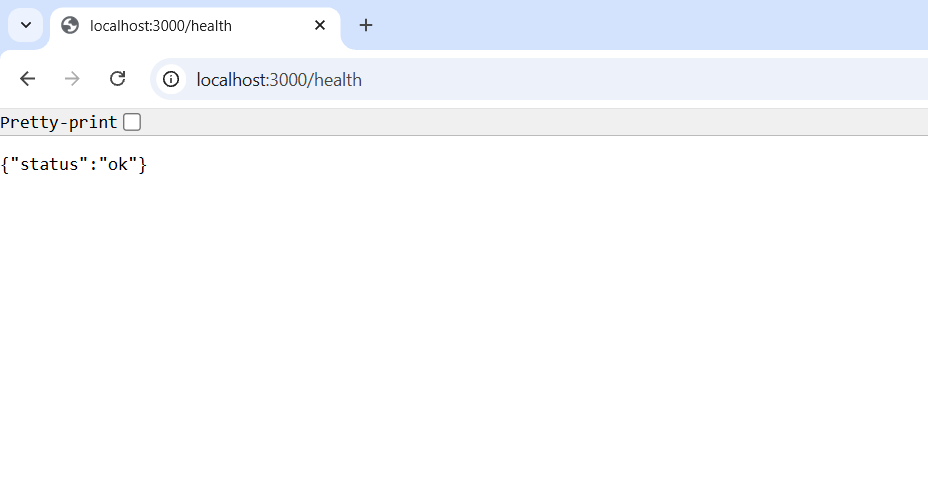
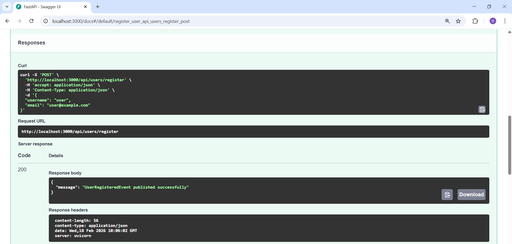
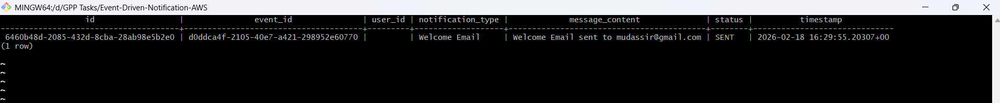
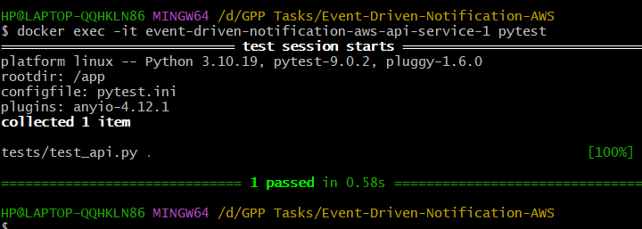
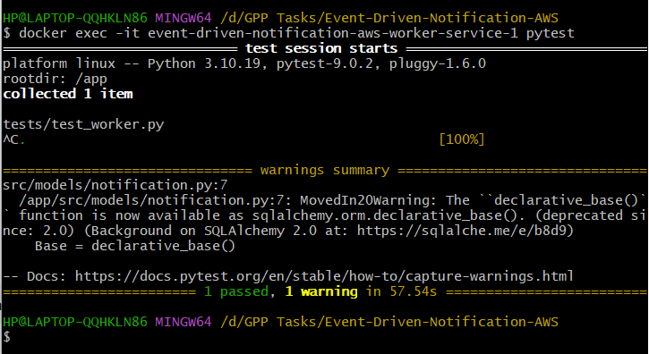

# Event Driven Notification System using AWS (SNS + SQS)

## Overview

This project demonstrates a **Production-Grade Event-Driven Architecture** using AWS messaging services.  
The system is designed to asynchronously process notification events using **SNS Topic** and **SQS Queue**.

Whenever a notification request is received through the API, the system publishes an event to SNS which is then delivered to an SQS queue.  
A background worker service polls messages from the queue and stores them into a PostgreSQL database.

This decouples the producer from the consumer and improves system scalability and fault tolerance.


## Architecture

```
Client Request
|
v
FastAPI Producer Service
|
v
SNS Topic
|
v
SQS Queue
|
v
Worker Service
|
v
PostgreSQL Database

```

## Technologies Used

- Python
- FastAPI
- AWS SNS
- AWS SQS
- PostgreSQL
- SQLAlchemy
- Boto3
- Docker
- Docker Compose
- LocalStack (AWS Local Simulation)


## Project Structure

```
event-driven-order-processing/
│
├── api-service/
│   ├── src/
│   │   ├── models/
│   │   │   └── user.py
│   │   │
│   │   ├── routes/
│   │   │   └── events.py
│   │   │
│   │   ├── services/
│   │   │   └── eventPublisher.py
│   │   │
│   │   ├── app.py
│   │   ├── database.py
│   │   └── events.py
│   │
│   ├── tests/
│   │   └── test_api.py
│   │
│   ├── Dockerfile
│   └── requirements.txt
│
├── worker-service/
│   ├── src/
│   │   ├── models/
│   │   │   ├── notification.py
│   │   │   └── notificationRepo.py
│   │   │
│   │   ├── services/
│   │   │   └── notificationProcessor.py
│   │   │
│   │   ├── __init__.py
│   │   ├── database.py
│   │   └── worker.py
│   │
│   ├── tests/
│   │   └── test_worker.py
│   │
│   ├── Dockerfile
│   └── requirements.txt
│
├── .env.example
├── .gitignore
├── ARCHITECTURE.md
├── docker-compose.yml
├── localstack-init.sh
└── README.md

````


## Setup Instructions

### Step 1: Clone Repository

```bash
git clone <your-repo-url>
cd Event-Driven-Notification-AWS
````

### Step 2: Start Docker Services

Run the following command inside project root directory:

```bash
docker-compose up --build
```

This will start:

* FastAPI API Service
* Worker Service
* PostgreSQL Database
* LocalStack (SNS + SQS)


### Step 3: Verify API is Running

Open browser and go to:

```
http://localhost:3000/docs
```

Swagger UI should open successfully.


## Sending Notification Event

Use the following command in Git Bash:

```bash
curl -X POST http://localhost:3000/notify \
-H "Content-Type: application/json" \
-d "{\"message\":\"Hello Event Driven System\"}"
```

## Verifying Database Storage

Run:

```bash
docker exec -it event-driven-notification-aws-database-1 psql -U user -d event_db
```

Inside PostgreSQL:

```sql
\dt
SELECT * FROM notifications;
```

You should see the processed notification stored in the database.

---

## Event Flow

1. Client sends POST request to `/notify`
2. API publishes message to SNS Topic
3. SNS forwards message to SQS Queue
4. Worker polls message from SQS
5. Worker processes event
6. Notification stored in PostgreSQL


## Idempotency

Worker service ensures message processing happens exactly once by:

* Processing messages sequentially
* Deleting messages after successful database insertion
* Preventing duplicate processing from the queue


## Stopping the Application

```bash
docker-compose down
```

## Outcome

* Implemented asynchronous event-driven processing
* Achieved producer-consumer decoupling
* Used SNS for event distribution
* Used SQS for reliable message delivery
* Persisted processed events in PostgreSQL
* Containerized entire application using Docker

## Screenshots

### API Health Check


### Swagger UI Endpoints


### Notifications Table Created


### API Tests Passed


### Worker Tests Passed

